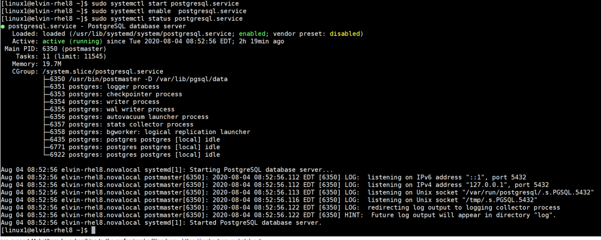
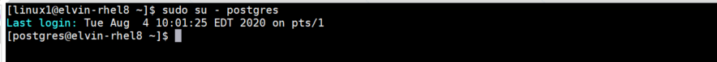
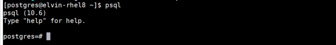
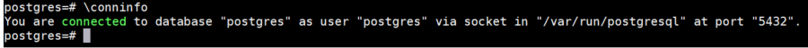
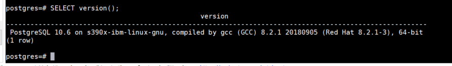
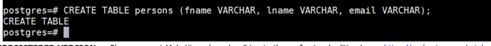
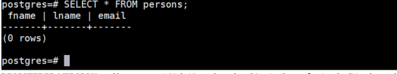

# How to install postgres database server on LinuxONE Community Cloud
Open source software is increasingly becoming available on the mainframe(IBM z/LinuxONE). PostgreSQL, also known as Postgres, is a free and open-source relational database management system emphasizing extensibility and SQL compliance. 

There are benefits running Postgres, the features is aimed to help developers build applications, administrators to protect data integrity and build fault-tolerant environments, and help you manage data no matter how big or small the dataset.
In this tutorial, we’ll be using Rhel 8 and Sles 15, which are popular Linux Platform compatible to LinuxONE machine. Some steps might be little different if you are using different architecture

## Prerequisites
 1. Request access to LinuxONE Community Cloud. Follow instructions [here](https://github.com/Elvin94/LinuxONE-OSS-CC)


### Step 1: Install postgres database server on LinuxONE Community Cloud
   1.1 Import postgres package
   ```sh
   rpm --import http://packages.2ndquadrant.com/postgresql-z/RPM-GPG-KEY-2NDQ-RHEL7
   ```
    
   1.2 Configure yum repo
   ```sh
   yum-config-manager --add-repo http://packages.2ndquadrant.com/postgresql-z/yum/12/rhel7-s390x
   ```
   1.3 Install postgresql
   ```sh
   sudo yum install postgresql-server
   ```
   
   
   ### Step 2: Configure Postgresql server
   
   2.1 Start postgresql service
   ```sh
   sudo system start postgresql.service 
   ```
   2.2 Enable postgres
   ```sh
  sudo system enable postgresql.service 
   ```
   2.3 Check status of the postgresql server
   ```sh
   sudo systemctl status postgresql.service 
   ```
   
   Optional - Output should look like this
   
   
   
    
   ### Step 3: Connect to Postgresql Database
   
   3.1 Change the user to default postgres user
   ```sh
   sudo su - postgres 
   ```
   
   
   3.2 Enter command "psql" to get to postgresql command line
   ```sh
   psql 
   ```
   
   
   3.3 Check connection
   ```sh
   \conninfo
   ```
   
    
   3.4 Check postgres version
   ```sh
    SELECT VERSION();
   ```
    
   
   ### Step 4: Interact with Postgresql Database
   4.1 Create a table called persons
   ```sh
   CREATE TABLE persons; 
   ```
   
   
   4.2 Check the table data
   ```sh
   SELECT * FROM persons; 
   ```
   
   
   4.3 Insert data into the table
   ```sh
   INSERT INTO persons(fname,lname,email) VALUES('elvin', 'maditsi', 'elvin@postgres.com'); 
   ```
   
   
   4.4 List data on table
   ```sh
   SELECT * FROM persons; 
   ```
   
   
   
   
 
